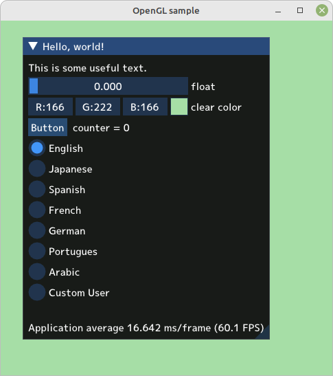
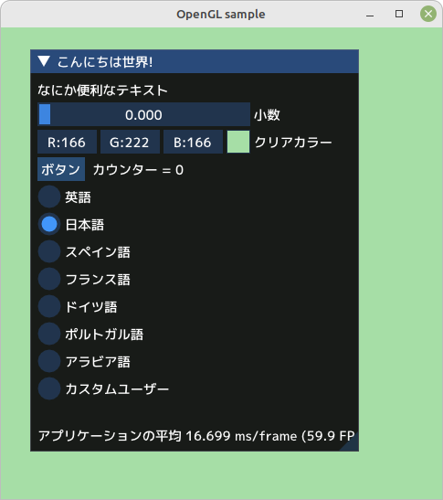
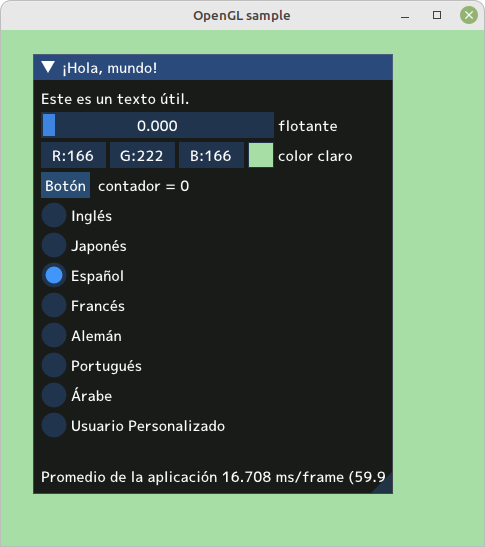
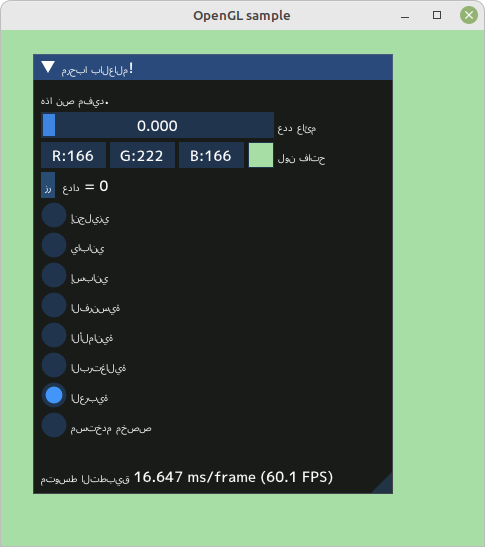

# marLocale Module
## Overview

This module is designed to support internationalization for C++ applications. Since the language configuration files are in JSON format, users can easily localize by editing the JSON files in their environment.

## Screenshots

<div style="display: flex; justify-content: space-around; align-items: center;">
  
  
</div>
<div style="display: flex; justify-content: space-around; align-items: center;">
  
  
</div>


## How to Use

We recommend referring to the simple samples provided, which work on both Windows and Linux platforms.

```cpp
#include <stdio.h>
#include "marLocale.h"

int main()
{
  setLanguage("es");
  printf("%s\n", translate("Hello World").c_str());
  return 0;
}
```

### JSON File Example

Below is an example of a Spanish translation file. The actual file should be saved as lang/translations_es.json.

```json
{
  "Hello World": "Hola mundo",
  "Goodbye": "Adiós"
}
```

## Sample Programs

-    01_commandline: This is a very simple command-line program for internationalization support.
-    02_gui: A GUI program using ImGui. It uses OpenGL but focuses on translating GUI elements, making it easy to understand.

### Building the Sample Programs

Building on Windows and Linux is as simple as running the provided makefile.

```bash
make
```

## Requirements

#### nlohmann/json
This project depends on the **nlohmann/json** library for JSON handling. Below are the setup instructions for different operating systems.
##### Windows (using MSYS2):

You can install the nlohmann/json library easily using pacman in MSYS2.

```bash
pacman -S mingw-w64-x86_64-nlohmann-json
```

##### Linux Mint (Ubuntu):

For Linux Mint, you can download the library directly from the GitHub releases page and install it manually.

```bash
sudo mkdir -p /usr/include/nlohmann
sudo wget https://github.com/nlohmann/json/releases/download/v3.10.5/json.hpp -O /usr/include/nlohmann/json.hpp
```

#### GLFW and GLEW

Although marLocale does not require GLFW and GLEW, they are necessary to run the sample application 02_gui.

##### Windows (using MSYS2):

```bash
pacman -Syu
pacman -S mingw-w64-x86_64-glfw
pacman -S mingw-w64-x86_64-glew
```

##### Linux Mint (Ubuntu):

```bash
sudo apt update
sudo apt install -y libglfw3 libglfw3-dev
sudo apt install -y libglew-dev
```

## License

This project is published under the [MIT License](LICENSE.txt).